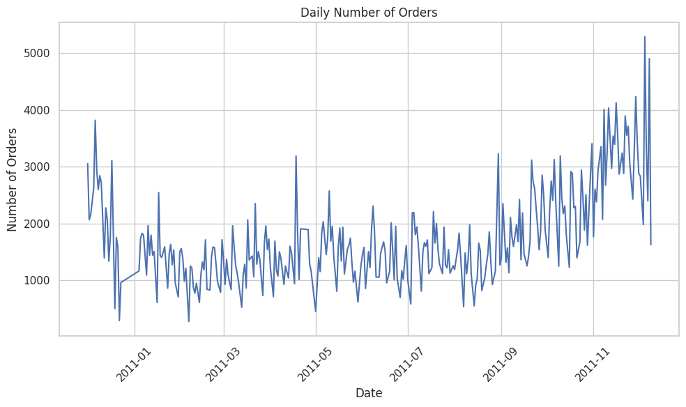
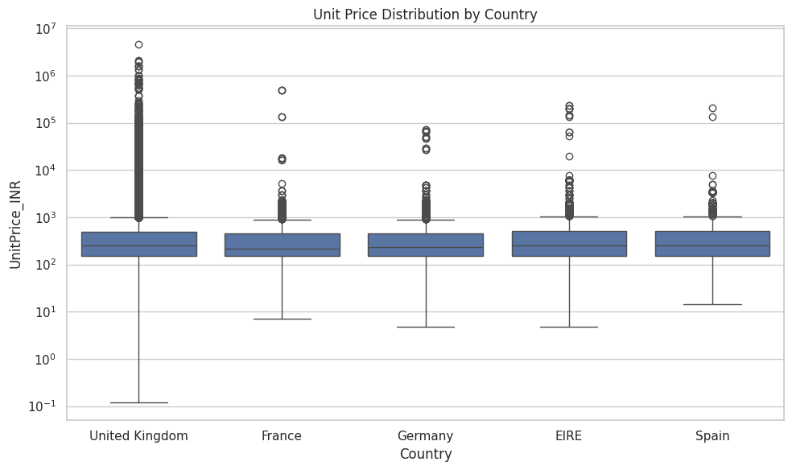

# online-retail-analysis-excel-python-powerbi
### End-to-end retail data analysis using Excel, Python (EDA), and Power BI dashboard visualization.

---

## 📌 Project Overview

This project performs an end-to-end analysis of online retail transaction data using a structured analytical workflow:

- **Excel** – Initial data structuring and formatting  
- **Python (Jupyter Notebook)** – Data cleaning and Exploratory Data Analysis (EDA)  
- **Power BI** – Interactive dashboard and business visualization  

The objective is to identify revenue drivers, pricing behavior, country performance, and overall sales trends.

---

## 🔄 Project Workflow

### 1️⃣ Data Structuring (Excel)

- Removed unnecessary columns
- Standardized date formats
- Organized data for analysis
- Verified data consistency

---

### 2️⃣ Data Cleaning & EDA (Python - Jupyter Notebook)

- Removed duplicates and invalid entries
- Handled missing values
- Converted data types
- Created derived columns (e.g., Line Total)
- Analyzed:
  - Sales trends over time
  - Unit price distribution
  - Country-wise order behavior
  - Outlier detection using log scaling

---

### 3️⃣ Data Visualization (Power BI Dashboard)

The Power BI dashboard includes:

- Executive Sales Overview
- Top Revenue-Contributing Countries
- Product Performance Analysis
- Order Behavior Insights
- Revenue Distribution Patterns

---

## 📊 Key Exploratory Insights

### 📈 Daily Number of Orders (Time Series)

This visualization highlights order fluctuations across the year, revealing seasonal spikes and increasing activity in later months.

---

### 📊 Unit Price Distribution (Log Scale)

Retail pricing is highly skewed due to extreme outliers. A logarithmic scale was applied to better visualize pricing spread and detect anomalies.

.png)

---

### 📦 Unit Price Distribution by Country (Boxplot)

The boxplot compares pricing distribution across major countries, revealing variations in pricing patterns and outlier concentration.

---

## 🛠 Tools & Technologies Used

- **Microsoft Excel**
- **Python (Pandas, NumPy, Matplotlib, Seaborn)**
- **Jupyter Notebook**
- **Microsoft Power BI**
- **GitHub**

---

## 📁 Repository Structure

online-retail-analysis/
│
├── data/
│ ├── raw/
│ └── processed/
│
├── excel/
├── notebooks/
├── powerbi/
├── images/
└── README.md

---

## 🎯 Business Objective

To analyze transactional retail data and uncover:

- Revenue concentration patterns
- Country-level performance
- Pricing behavior & outliers
- Seasonal order trends
- High-impact revenue drivers

---

## 📌 Key Takeaways

- Significant revenue concentration observed in specific countries.
- Unit prices exhibit heavy skewness and extreme outliers.
- Sales activity increases notably during Q4.
- Pricing behavior varies across international markets.

---

## 🎥 Dashboard Demonstration

🔗 [Watch the Power BI Dashboard Demo on LinkedIn](https://www.linkedin.com/feed/update/urn:li:activity:74283836508006318)

---

## 📄 License

This project is licensed under the MIT License.

---

## 👨‍💻 Author

**Sateesh Kumar Patlegar**

💼 Open to Data Science, Analytics, and Quant roles  

📧 Email: patlegarsateeshkumar@gmail.com  

🔗 LinkedIn: https://www.linkedin.com/in/patlegar-sateesh-kumar-868870258/

