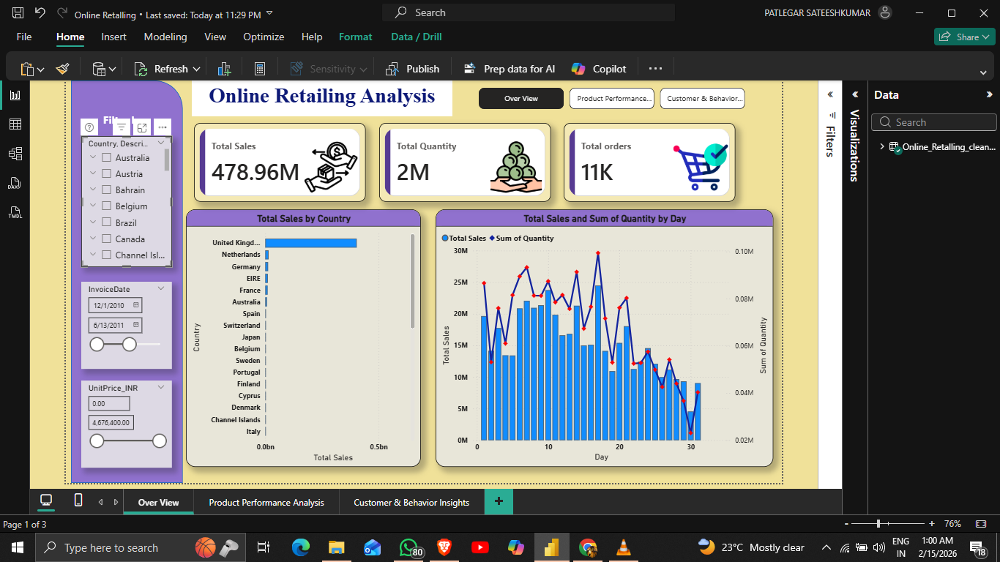
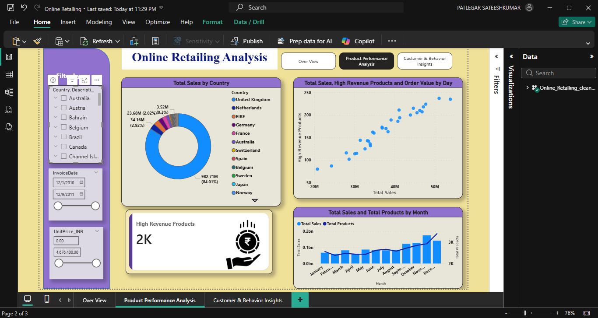
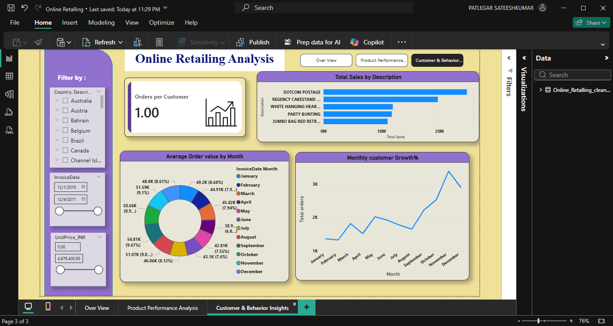

# 📊 Online Retail Sales Analysis  
### End-to-End Data Analysis using Excel, Python (EDA), and Power BI

---

## 🚀 Project Summary

This project presents a complete end-to-end analysis of online retail transaction data using Excel, Python, and Power BI.  
The workflow covers structured data preparation, exploratory data analysis, statistical distribution evaluation, and interactive business dashboard development.

The objective is to identify revenue drivers, pricing behavior patterns, regional performance trends, and seasonal sales fluctuations.

---

## 🎯 Business Objective

To analyze retail transaction data and uncover:

- Revenue concentration across countries  
- Pricing distribution and outlier behavior  
- Seasonal demand patterns  
- High-impact revenue-driving segments  
- Market-level performance insights  

The insights support data-driven pricing strategies, regional prioritization, and sales optimization.

---

## 🔄 Project Workflow

### 1️⃣ Data Structuring (Excel)

- Removed unnecessary columns  
- Standardized date formats  
- Organized structured transaction data  
- Ensured data consistency before analysis  

---

### 2️⃣ Data Cleaning & Exploratory Data Analysis (Python – Jupyter Notebook)

- Removed duplicates and invalid entries  
- Handled missing values  
- Converted data types for accuracy  
- Created derived metrics (e.g., Line Total)  
- Conducted analysis on:
  - Sales trends over time  
  - Unit price distribution  
  - Country-wise order contribution  
  - Outlier detection using logarithmic scaling  

---

### 3️⃣ Data Visualization (Power BI Dashboard)

The interactive dashboard includes:

- Executive Sales Overview  
- Top Revenue-Contributing Countries  
- Product Performance Analysis  
- Order Behavior Insights  
- Revenue Distribution Patterns  

The dashboard enables dynamic filtering and performance monitoring.

---

## 📊 Key Exploratory Insights

### 📈 Daily Number of Orders (Time Series)

This time-series visualization highlights order volume fluctuations throughout the year, revealing seasonal spikes and increased activity during Q4.


---

### 📊 Unit Price Distribution (Log Scale)

Retail pricing exhibited significant skewness due to extreme outliers.  
A logarithmic scale was applied to better visualize pricing spread and detect anomalies.

.png)

---

### 📦 Unit Price Distribution by Country (Boxplot)

The boxplot comparison reveals variations in pricing behavior across major countries, including spread differences and outlier concentration.


---

## 📊 Power BI Dashboard Preview



---



---



---

## 📌 Key Findings

- Revenue concentration is heavily driven by a limited number of countries.
- Unit price data is highly skewed, requiring log transformation for accurate interpretation.
- Seasonal demand increases significantly during Q4.
- Sales distribution suggests strong revenue clustering in specific segments.
- Regional pricing behavior varies considerably across markets.

---

## 🛠 Tools & Technologies Used

- **Microsoft Excel**
- **Python (Pandas, NumPy, Matplotlib, Seaborn)**
- **Jupyter Notebook**
- **Microsoft Power BI**
- **GitHub**

---

## 📁 Repository Structure

```
online-retail-analysis-excel-python-powerbi/
│
├── data/
│   ├── raw/
│   └── processed/
│
├── excel/
├── notebooks/
├── powerbi/
├── images/
└── README.md
```

---

## 📈 Conclusion

This project demonstrates a complete analytics pipeline — from raw data structuring to advanced exploratory analysis and business intelligence visualization.

Through statistical evaluation, trend analysis, and dashboard-driven insights, the analysis highlights:

- Revenue concentration dynamics  
- Market-level sales performance  
- Pricing distribution irregularities  
- Seasonal purchasing behavior  

The structured workflow reflects real-world analytical practices used in business decision-making environments.

---

## 📄 License

This project is licensed under the MIT License.

---

## 👨‍💻 Author

**Sateesh Kumar Patlegar**

💼 Open to Data Science, Analytics, and Quantitative roles  

📧 patlegarsateeshkumar@gmail.com  

🔗 LinkedIn: https://www.linkedin.com/in/patlegar-sateesh-kumar-868870258/

